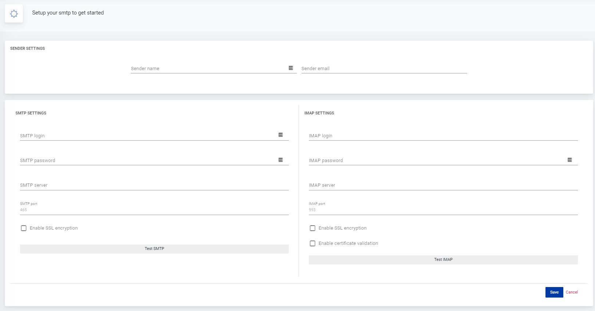
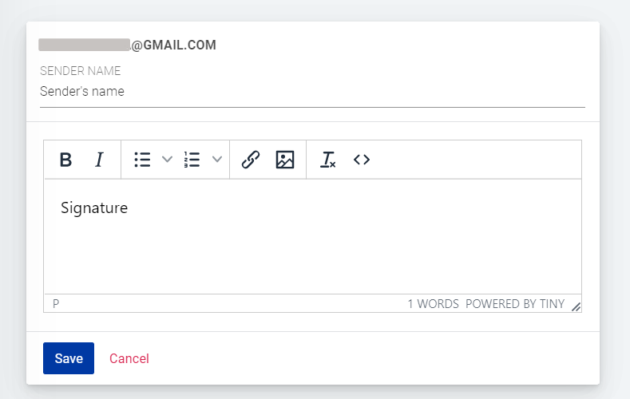

# Adding a mail account

Learn how to easily add and set up a mail account

To add a mail account you need to navigate to the Email accounts and click on **+Create** email account. You will get two options: add a Gmail/G suite mail account or add any other SMTP account.

 

## Gmail/G suite account

- Click on the Gmail/G suite icon to add a Gmail/G suite mail account;
- A new window will open where you will need to sign up to your account;
- Click Next to go to the next steps and grant needed permissions;
- That’s it - the account is connected!

## Other SMTP account

- Click on SMTP icon;
- In the provided form you’ll need to fill all fields: a sender’s name and email, both SMTP and IMAP logins, passwords, servers and ports;
- Click on Test SMTP and Test IPAM to check if provided credentials are correct - a notification will inform you if everything is alright;
- Enabling SSL encryption and certificate validation is optional, yet we recommend enabling them to increase the security of transactions;
- Finally, click Save to connect the account.

 

**Note:** mail accounts’ number is not limited, add and use as many mail accounts as you need.

Once the mail account is added click Edit to set your **sender’s name** and a **signature**.
A recognisable sender’s name and informative signature will complete your email in a proper tone.

 

