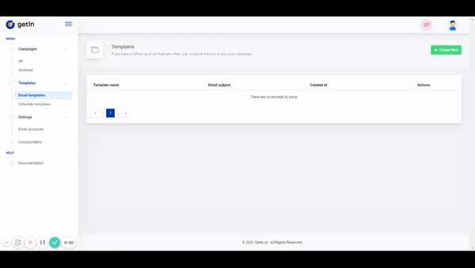

# Creating an email template

Learn how to simply and quickly create an email template

To create an email template you need to navigate to *Templates > Email templates* and click on a button *+Create new*. In the provided form you’ll need to enter Template name, Email subject and the message text.

**Note:** in this step you can **add tags** which will be used to filter templates. Type in a new tag and click Enter to add the tag, or choose from provided tags you have created earlier. Tags can include both lowercase and uppercase letters, numbers, special signs and spaces.

Message text can be edited with standard formatting. An image can be added to the message if it is accessible via the web.

**To add an image:**
click on image icon > provide image source URL > type in image name > edit width and height, if needed > click Save.

After all fields are filled - click Save and the email template is created!

 

