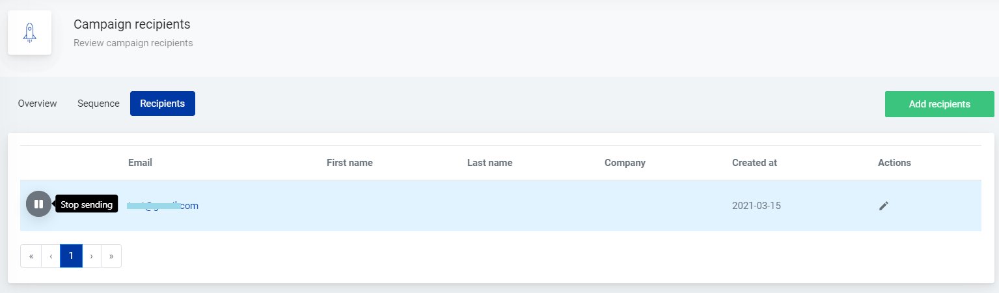
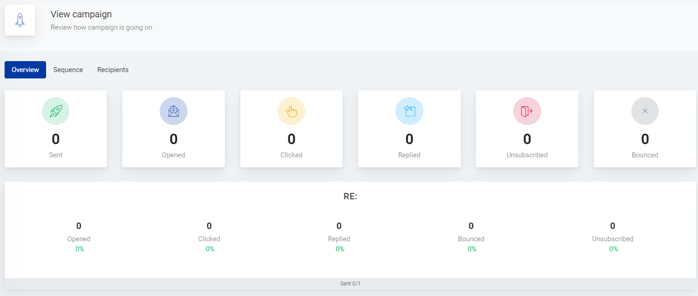
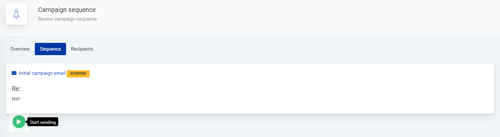
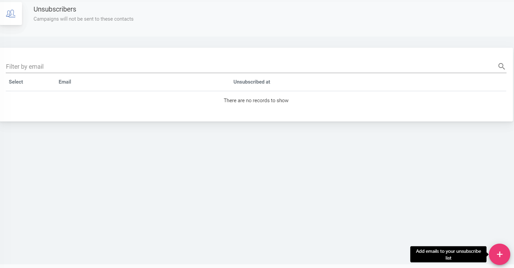

# Campaign reports

Learn about campaign reports and unsubscribing contacts

Once the campaign has started sending you can click on the campaign name to check it’s report. The main metrics such as number of sent out messages, number of contacts who opened, clicked or replied to the message is shown in the *Overview* tab. As well as the number of bounced or unsubscribe contacts. 

 

The message/messages of the campaign are displayed in the *Sequence* tab. Campaign can be paused and resumed on this page, also. 

 

The list of campaign sequences for each contact is placed under *Recipients* tab. There you can pause or resume the campaign for each recipient individually.

Information about the recipient - name, last name, company name - can be added by clicking on *Actions* icon in the recipient’s row.

The contact’s history of received messages is shown after clicking on contact’s email address.

 

You can find the list of unsubscribed recipients under **Unsubscribers**.

Recipients who unsubscribe via unsubscribe link in the received message are added to the list. Unsubscribed recipients can be added to this list manually, too - just click on the plus button in the lower right corner.

 

