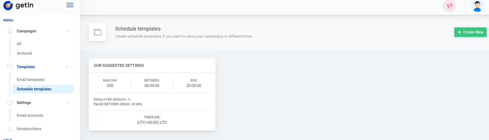

# How to setup a schedule template

Learn how to setup different sending schedulers for campaigns

Before sending out a campaign you’ll need to create a schedule template for your campaign - it is a schedule defining to how many contacts your emails will be going out, how often and when. One default schedule template is already prepared for you in the account.

 

To create a new schedule template you need to navigate to *Templates > Schedule templates* and click *+Create new*. In the provided form you’ll need to fill these fields:

- Your scheduler name;
- Pause in minutes between sends - time period between email batches sending;
- Send messages per day - set a limit of messages for the day. Please note that it will not be exceeded if other settings indicate sending more emails than the set limit;
- Select the time zone;
- Select from at what hours of the day messages will be going out;
- Select on which days messages will be going out.

Click *Save* and the scheduler is ready!

 

**Note:** once the schedule template is saved it cannot be edited or deleted.
