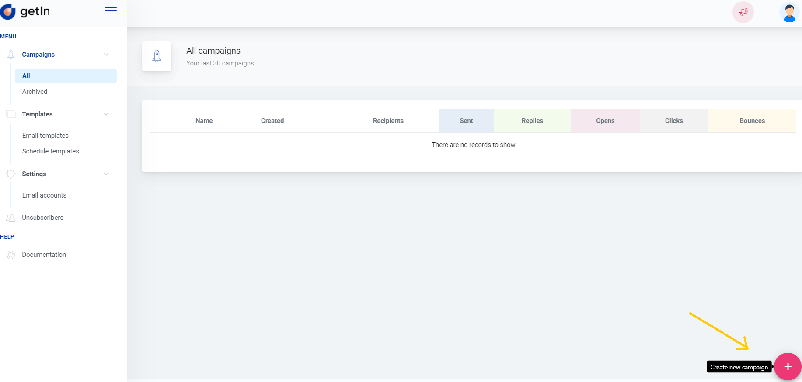
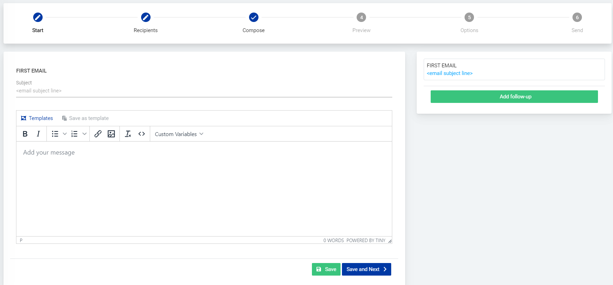
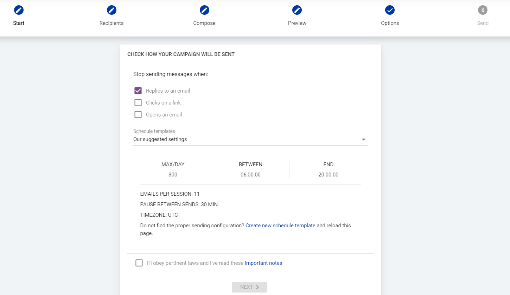
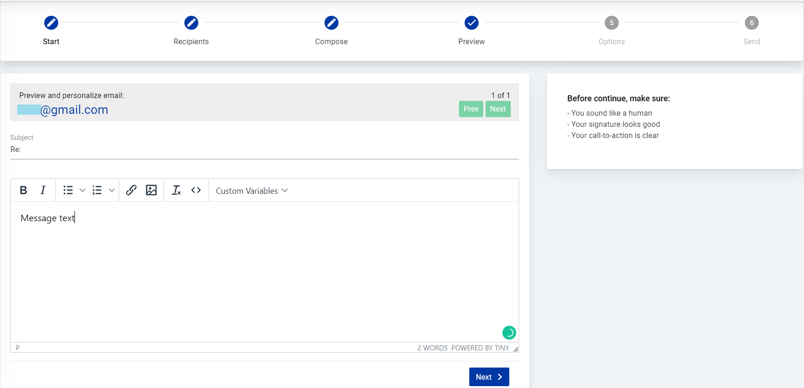
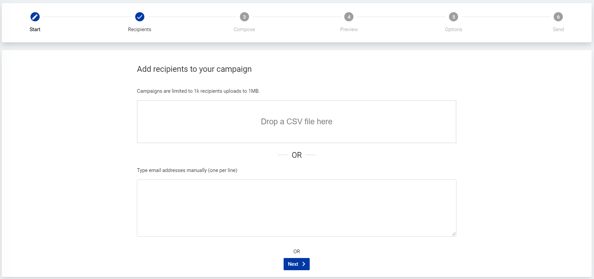
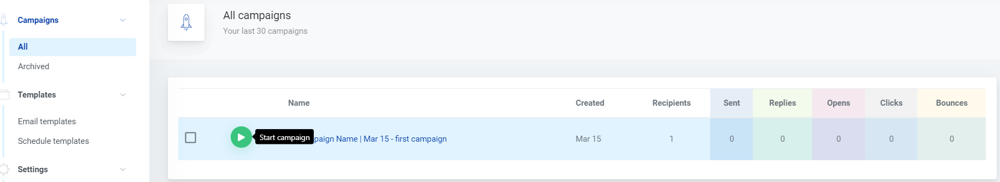
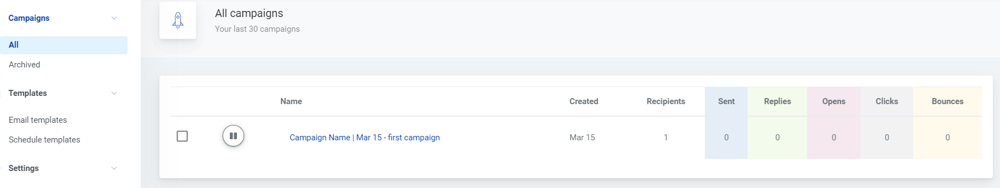

# How to send out a campaign

Learn how to setup and send out campaigns

To start a new campaign go to *Campaigns > All* and click the red plus button in the lower right corner and you’ll be forwarded to the first step of setting up a campaign.

 

**First step:** type in campaign name and select the mail account from which emails will be sent and click Next to proceed.

**Second step:** you need to provide a list of recipients. It can be done either by uploading a file with the recipients list or typing in the list of recipients - don’t forget to click *Import* afterwards! This step can be skipped and you can go to the other step by clicking Next. But note that you’ll not be able to send out the campaign without recipients added.

 

**Third step:** set up a message by typing in the subject line and message text. If you want to use your previously created template or use one of our prepared templates - just click on *Templates*.

**Note:** Custom Variables such as recipient name, last name, Company name and unsubscribe link can be added to the message in this step.

Additionally, **follow up emails** can be set in this step. Click on *Add follow-up* to pick a delay and add another email to the flow.

 

**Fourth step:** a preview of how the campaign will look to the recipients. You can check the message for each recipient individually and also edit the message text. 

 

**Fifth step:** the final settings of the campaign. Select when the messages will be stopped being sent to the recipient, select a schedule template or create a new schedule template. 

After checking the checkbox and familiarizing with the sending terms click Next to finalize the setup.

 

**Last step:** a summary of the setup. Click *Start your campaign* to send it out right away or save the setup as a draft by clicking *Save as draft*. 

Once the campaign has started you can always **pause** it in the *All campaigns* page by clicking the pause sign next to the campaign. And likewise you can **resume** the campaign by clicking the start sign.

 
 
